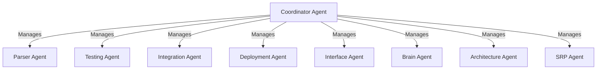

# Project Genesis: The Dawn of Autonomous Code Evolution

## 📜 Overview
Project Genesis is an open-source initiative designed to automate the software development process by embedding best coding practices such as SRP, testing, and DI. It leverages intelligent agents to interface with various IDEs, enhancing developers' productivity. 

## Disclaimer: This project is opinionated by Manu's perspective on decades of experience in coding.

## 🏛️ Core Principles
- 🧼 **Clean Code**: Ensuring code clarity and maintainability.
- ✅ **Testing**: Prioritizing automated testing for reliable software.
- 🧩 **Modularity**: Adhering to SRP for a structured and scalable codebase.
- 🔧 **Maintainability**: Incorporating DI for flexible and manageable systems.

## 🏗️ Architecture
Project Genesis utilizes a multi-agent system to cover different aspects of both project management and coding:

### Project Management Agents
- 💼 **Monetization Agent**: Analyzes and implements strategies for project monetization in an open-source context.
- 📊 **HR Agent**: Manages project contributors, fostering a skilled and innovative team.
- 🎨 **Branding Agent**: Cultivates the project's public image and outreach strategies.

### Coding Agents
- 🤖 **Parser Agent**: Reviews the codebase for SRP compliance, suggesting improvements where necessary.
- 🧪 **Testing Agent**: Creates and runs tests to ensure code quality and functionality.
- 🔗 **Integration Agent**: Handles module dependencies and integration, respecting DI principles.
- 🚀 **Deployment Agent**: Manages the deployment process through CI/CD pipelines.
- 🖥️ **Interface Agent**: Links the toolchain to various IDEs for a unified coding experience.
- 🧠 **Brain Agent**: Connects with LLMs to provide advanced code intelligence.
- 🔄 **Coordinator Agent**: Harmonizes the operations of all agents for optimal workflow.
- 🏛️ **Architecture Agent**: Oversees the overall structure of the codebase, guiding design patterns.
- ✂️ **SRP Agent**: Splits and refactors the codebase to enforce SRP.

## 🔄 Operating Logic and Feedback Loops
Each agent incorporates a feedback mechanism to learn from its operations and outcomes, constantly improving its processes and interactions with other agents.

## 📊 Mermaid Diagrams
Below is an example of a Mermaid diagram to illustrate the coordination between agents:

## 🛠️ Technologies
Detail the specific technologies, languages, and frameworks used in the project.

## 🚀 Getting Started
Step-by-step instructions for setting up the Project Genesis environment.

## 📖 Usage
Guidance and examples on using Project Genesis across various IDEs.

## 📋 Project Coordination
Information on the organizational tools and methods used to keep the project on track and aligned with its goals.

## 🤝 Contributing
Guidelines for contributors to ensure their work aligns with the project's core principles and standards.

## 📄 License
The licensing information under which Project Genesis is released.

## 📬 Contact
Contact information for the project maintainers for support, collaboration, or inquiries.

